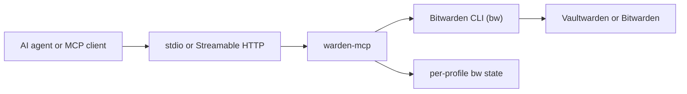

# warden-mcp

**Vaultwarden / Bitwarden MCP server for credential-aware AI agents.**

[](https://www.npmjs.com/package/@icoretech/warden-mcp)
[](https://github.com/icoretech/warden-mcp/actions/workflows/ci.yml)
[](LICENSE)
[](package.json)
[](https://ghcr.io/icoretech/warden-mcp)

`warden-mcp` lets MCP clients search, create, update, move, and read
Vaultwarden or Bitwarden vault items through the official Bitwarden CLI (`bw`).
It is built for agents and automation that need credentials, TOTP codes, secure
notes, attachments, Sends, folders, organizations, and collections without
re-implementing Bitwarden client-side crypto.

Use it when an agent needs to log in to real systems during a browser or admin
workflow, but you do not want passwords hardcoded in prompts, config files, or
one-off scripts.

## Quick Start

Use stdio mode when a local MCP host launches the server directly. It is the
simplest and most portable setup for desktop agents.

Prerequisites:

- Node.js 24+
- npm
- a Vaultwarden or Bitwarden account
- either a Bitwarden API key pair or username/password login

Run the server:

```bash
BW_HOST=https://vaultwarden.example.com \
BW_CLIENTID=user.xxxxx \
BW_CLIENTSECRET=xxxxx \
BW_PASSWORD='your-master-password' \
npx -y @icoretech/warden-mcp@latest --stdio
```

Username login also works:

```bash
BW_HOST=https://vaultwarden.example.com \
BW_USER=user@example.com \
BW_PASSWORD='your-master-password' \
npx -y @icoretech/warden-mcp@latest --stdio
```

If the package is useful, [star the repository](https://github.com/icoretech/warden-mcp)
so other agent builders can find it.

## Install In MCP Hosts

Most local hosts should use stdio. The examples below use API-key auth; replace
`BW_CLIENTID` and `BW_CLIENTSECRET` with `BW_USER` if you prefer username login.

### Claude Code

```bash
claude mcp add-json warden '{"command":"npx","args":["-y","@icoretech/warden-mcp@latest","--stdio"],"env":{"BW_HOST":"https://vaultwarden.example.com","BW_CLIENTID":"user.xxxxx","BW_CLIENTSECRET":"xxxxx","BW_PASSWORD":"your-master-password"}}'
```

### Codex

```bash
codex mcp add warden \
  --env BW_HOST=https://vaultwarden.example.com \
  --env BW_CLIENTID=user.xxxxx \
  --env BW_CLIENTSECRET=xxxxx \
  --env BW_PASSWORD='your-master-password' \
  -- npx -y @icoretech/warden-mcp@latest --stdio
```

Codex TOML config:

```toml
[mcp_servers.warden]
command = "npx"
args = ["-y", "@icoretech/warden-mcp@latest", "--stdio"]
startup_timeout_sec = 30

[mcp_servers.warden.env]
BW_HOST = "https://vaultwarden.example.com"
BW_CLIENTID = "user.xxxxx"
BW_CLIENTSECRET = "xxxxx"
BW_PASSWORD = "your-master-password"
```

`startup_timeout_sec = 30` gives `npx` enough time for a cold first launch.

### Cursor, Claude Desktop, And JSON Config Hosts

```json
{
  "mcpServers": {
    "warden": {
      "command": "npx",
      "args": ["-y", "@icoretech/warden-mcp@latest", "--stdio"],
      "env": {
        "BW_HOST": "https://vaultwarden.example.com",
        "BW_CLIENTID": "user.xxxxx",
        "BW_CLIENTSECRET": "xxxxx",
        "BW_PASSWORD": "your-master-password"
      }
    }
  }
}
```

Common locations:

| Host | Config file |
| --- | --- |
| Cursor | `~/.cursor/mcp.json` or `.cursor/mcp.json` |
| Claude Desktop | `~/Library/Application Support/Claude/claude_desktop_config.json` |
| Codex | `~/.codex/config.toml` |

## Why Use It

- **Agent login flows** - fetch usernames, passwords, and TOTP codes during real
  browser automation without storing secrets in the agent prompt
- **Safe by default** - secret fields stay redacted unless a tool supports
  `reveal: true` and the client explicitly asks for it
- **Vault administration** - create, update, move, restore, and delete common
  Bitwarden item types, folders, organization collections, attachments, and Sends
- **Shared HTTP mode** - one long-running service can front multiple vault hosts
  or identities through per-request `X-BW-*` headers
- **Text-only client support** - safe identifiers are mirrored into text output
  for MCP hosts that ignore `structuredContent`
- **Vaultwarden-first CI** - the integration suite exercises real local
  Vaultwarden and `bw` auth/session flows, not only mocked SDK behavior

## How It Works



`warden-mcp` shells out to `bw` and keeps profile state under
`KEYCHAIN_BW_HOME_ROOT`. In HTTP mode, profile selection and credentials come
from request headers. In stdio mode, credentials are loaded from `BW_*` env vars
when the process starts.

The HTTP server exposes:

| Endpoint | Purpose |
| --- | --- |
| `GET /healthz` | liveness check; does not validate vault credentials |
| `GET /metricsz` | session and runtime guardrail metrics |
| `/sse?v=2` | MCP Streamable HTTP endpoint |

## Run As A Shared HTTP Service

HTTP mode is useful when one service should serve multiple clients or multiple
vault profiles.

Start the server:

```bash
npx -y @icoretech/warden-mcp@latest
```

Verify liveness:

```bash
curl -fsS http://localhost:3005/healthz
```

MCP tool calls must include these headers unless env fallback is explicitly
enabled:

| Header | Meaning |
| --- | --- |
| `X-BW-Host` | HTTPS origin only, for example `https://vaultwarden.example.com` |
| `X-BW-Password` | master password used to unlock the vault |
| `X-BW-ClientId` | Bitwarden API key client id |
| `X-BW-ClientSecret` | Bitwarden API key client secret |
| `X-BW-User` or `X-BW-Username` | username/email alternative to API key login |
| `X-BW-Unlock-Interval` | optional unlock interval in seconds; default `300` |

Example HTTP MCP config for hosts that support custom headers:

```json
{
  "mcpServers": {
    "warden": {
      "url": "http://localhost:3005/sse?v=2",
      "headers": {
        "X-BW-Host": "https://vaultwarden.example.com",
        "X-BW-ClientId": "user.xxxxx",
        "X-BW-ClientSecret": "xxxxx",
        "X-BW-Password": "your-master-password"
      }
    }
  }
}
```

Some browser-hosted MCP clients can connect to an HTTP/SSE endpoint but cannot
send custom `X-BW-*` headers. For those clients, run a single-tenant HTTP server
with env fallback:

```bash
BW_HOST=https://vaultwarden.example.com \
BW_CLIENTID=user.xxxxx \
BW_CLIENTSECRET=xxxxx \
BW_PASSWORD='your-master-password' \
KEYCHAIN_ALLOW_ENV_FALLBACK=true \
npx -y @icoretech/warden-mcp@latest
```

Only use `KEYCHAIN_ALLOW_ENV_FALLBACK=true` behind a trusted network boundary.
Every client that can reach the endpoint inherits the configured vault identity.

For hosted clients that require HTTPS, put a reverse proxy, private tunnel, VPN,
or equivalent protected endpoint in front of `warden-mcp`, then connect to:

```text
https://warden-mcp.example.com/sse?v=2
```

## Docker

```bash
docker run --rm \
  -p 127.0.0.1:3005:3005 \
  -v warden-mcp-data:/data \
  ghcr.io/icoretech/warden-mcp:latest
```

The production image runs as the non-root `node` user with uid/gid `1000`, sets
`HOME=/data`, and stores Bitwarden profile state under `/data/bw-profiles` by
default. If you use a bind mount, make it writable by uid/gid `1000`.

## Runtime Requirements

`warden-mcp` requires Node.js 24+ when running from npm or source. The Docker
image includes the supported Node runtime.

The server resolves `bw` in this order:

1. `BW_BIN`, when set
2. bundled `@bitwarden/cli` optional dependency, when installed
3. system `bw` from `PATH`

The bundled `@bitwarden/cli` version is currently `2026.6.0`. This project keeps
that version vetted instead of blindly tracking every upstream release, because
auth and unlock behavior can change in ways that break automation.

If your package manager skips optional dependencies and `bw` is missing, install
the CLI explicitly or point `BW_BIN` to a known binary:

```bash
npm install -g @bitwarden/cli@2026.6.0
BW_BIN=/absolute/path/to/bw npx -y @icoretech/warden-mcp@latest --stdio
```

## Security Model

There is no built-in authentication layer in v1. Protect the transport before
you expose it.

- **Bind locally by default** - use `WARDEN_MCP_HOST=127.0.0.1`, Docker
  `-p 127.0.0.1:3005:3005`, a firewall, VPN, or an authenticated reverse proxy
- **Use TLS for HTTP mode** - `X-BW-*` headers carry vault credentials
- **Avoid env fallback on shared networks** - `KEYCHAIN_ALLOW_ENV_FALLBACK=true`
  makes server-side vault credentials available to headerless clients
- **Use read-only mode when writes are not needed** - `READONLY=true` or
  `KEYCHAIN_READONLY=true` hides mutating tools and rejects direct write calls
- **Use no-reveal mode for untrusted agent contexts** - `NOREVEAL=true` or
  `KEYCHAIN_NOREVEAL=true` forces all secret-returning tools to stay redacted
- **Keep debug logs off in production** - do not enable `KEYCHAIN_DEBUG_BW` or
  `KEYCHAIN_DEBUG_HTTP` unless actively troubleshooting
- **Restrict profile storage** - protect `KEYCHAIN_BW_HOME_ROOT`, which stores
  local `bw` profile state
- **Protect `/metricsz` if needed** - it is unauthenticated for scraper
  compatibility and exposes runtime/session counters

Redacted fields include login passwords, TOTP seeds/codes, card numbers and
codes, identity SSNs/passport/license numbers, hidden custom fields, SSH private
keys stored through the secure-note convention, signed attachment URLs, and
password history entries.

## Configuration

| Variable | Default | Purpose |
| --- | --- | --- |
| `PORT` | `3005` | HTTP listen port |
| `WARDEN_MCP_HOST` | all interfaces | HTTP bind host |
| `WARDEN_MCP_STDIO` | `false` | force stdio mode without `--stdio` |
| `MCP_APP_NAME` | `keychain-mcp` | advertised MCP server name |
| `TOOL_PREFIX` | `keychain` | public tool namespace |
| `TOOL_SEPARATOR` | `_` | public tool separator; set `.` for legacy clients |
| `KEYCHAIN_BW_HOME_ROOT` | `${HOME}/bw-profiles` | root for per-profile `bw` state |
| `KEYCHAIN_ALLOW_ENV_FALLBACK` | `false` | allow HTTP calls to inherit server `BW_*` env |
| `KEYCHAIN_SYNC_ON_WRITE` | `true` | run `bw sync` before write operations |
| `READONLY` / `KEYCHAIN_READONLY` | `false` | hide and reject mutating tools |
| `NOREVEAL` / `KEYCHAIN_NOREVEAL` | `false` | force `reveal: false` server-side |
| `KEYCHAIN_TEXT_COMPAT_MODE` | unset | set `structured_json` for text-only clients |
| `KEYCHAIN_SESSION_MAX_COUNT` | `32` | max tracked HTTP sessions |
| `KEYCHAIN_SESSION_TTL_MS` | `900000` | inactive session TTL |
| `KEYCHAIN_SESSION_SWEEP_INTERVAL_MS` | `60000` | session cleanup interval |
| `KEYCHAIN_MAX_HEAP_USED_MB` | `1536` | memory fuse; set `0` to disable |
| `KEYCHAIN_METRICS_LOG_INTERVAL_MS` | `0` | periodic metrics logging; `0` disables |

`KEYCHAIN_TEXT_COMPAT_MODE=structured_json` mirrors supported
`structuredContent` into plain text. That helps MCP clients that only pass
`content[]` to the model, but any revealed secret will also appear in the text
transcript.

## Tool Reference

Tool names default to `keychain_*`. Change the prefix with `TOOL_PREFIX` and the
separator with `TOOL_SEPARATOR`.

Start with these:

- `keychain_status` - inspect raw `bw` status
- `keychain_sync` - pull latest vault data with `bw sync`
- `keychain_search_items` - find items by name, URI, username, folder,
  collection, or type
- `keychain_get_item` - read a full item by id, redacted by default
- `keychain_get_username`, `keychain_get_password`, `keychain_get_totp` - fetch
  common login values; password and TOTP require `reveal: true`
- `keychain_create_login`, `keychain_update_item`,
  `keychain_move_item_to_organization` - common write paths

Full tool groups:

| Group | Tools |
| --- | --- |
| Vault/session | `keychain_status`, `keychain_sync`, `keychain_sdk_version`, `keychain_encode`, `keychain_generate`, `keychain_generate_username` |
| Items | `keychain_search_items`, `keychain_get_item`, `keychain_update_item`, `keychain_create_login`, `keychain_create_logins`, `keychain_set_login_uris`, `keychain_create_note`, `keychain_create_card`, `keychain_create_identity`, `keychain_create_ssh_key`, `keychain_delete_item`, `keychain_delete_items`, `keychain_restore_item` |
| Folders | `keychain_list_folders`, `keychain_create_folder`, `keychain_edit_folder`, `keychain_delete_folder` |
| Organizations and collections | `keychain_list_organizations`, `keychain_list_collections`, `keychain_list_org_collections`, `keychain_create_org_collection`, `keychain_edit_org_collection`, `keychain_delete_org_collection`, `keychain_move_item_to_organization` |
| Attachments | `keychain_create_attachment`, `keychain_delete_attachment`, `keychain_get_attachment` |
| Sends | `keychain_send_list`, `keychain_send_template`, `keychain_send_get`, `keychain_send_create`, `keychain_send_create_encoded`, `keychain_send_edit`, `keychain_send_remove_password`, `keychain_send_delete`, `keychain_receive` |
| Direct `bw get` helpers | `keychain_get_username`, `keychain_get_password`, `keychain_get_totp`, `keychain_get_notes`, `keychain_get_uri`, `keychain_get_exposed`, `keychain_get_folder`, `keychain_get_collection`, `keychain_get_organization`, `keychain_get_org_collection`, `keychain_get_password_history` |

Notes:

- `keychain_create_logins` creates several independent login items in one call
  and reports per-item failures without aborting the whole batch
- `keychain_set_login_uris` replaces or merges a login item's URI list without
  editing the entire item payload
- `keychain_delete_items` supports bulk soft-delete or hard-delete by id
- `keychain_get_item` exposes safe attachment metadata, including `id`,
  `fileName`, and size, while redacting signed download URLs
- `keychain_get_attachment` accepts an attachment id or an unambiguous filename
  and returns `{ filename, bytes, contentBase64 }`
- `keychain_send_get` returns owned Send metadata and text content; use
  `keychain_receive` with a Send `accessUrl` to receive shared Sends or download
  file Send bytes
- Ambiguous login lookups return `AMBIGUOUS_LOOKUP` with visible candidate ids;
  retry with the exact item id

## Local Development

Use Docker Compose when you need the full Vaultwarden-backed stack.

```bash
cp .env.example .env
make up
```

`make up` starts local Vaultwarden, an HTTPS proxy for `bw`, bootstraps a test
account, and runs the MCP server in the foreground.

Useful commands:

| Command | Purpose |
| --- | --- |
| `npm run dev` | watch-mode server from source |
| `npm run build` | compile TypeScript to `dist/` |
| `npm run start` | run the compiled server |
| `npm run lint` | Biome autofix plus `tsc --noEmit` |
| `npm run test` | build, then run all compiled tests |
| `npm run test:integration` | build, then run compose-backed integration tests |
| `npm run test:coverage` | build, then run Node test coverage |
| `make test` | run the compose-backed Vaultwarden integration path |
| `make test-org` | run the organization-focused compose stack |
| `make down` | stop the local compose stack |

For a quick live MCP smoke against local Vaultwarden, see
[agent-instructions/testing.md](agent-instructions/testing.md).

## Compatibility

Vaultwarden is the continuously proven target in CI. Official Bitwarden
compatibility is intended, but it is not continuously proven without a real
Bitwarden tenant.

`@bitwarden/cli` upgrades are treated as compatibility decisions. The suite
checks direct `bw` auth behavior, SDK behavior, and MCP integration behavior
against a local Vaultwarden instance before a CLI bump should ship.

## Known Limitations

- `bw list items --search`, and therefore `keychain_search_items`, does not
  reliably search inside custom field values
- SSH keys are stored as secure notes with standard fields until `bw` supports
  native SSH key item creation
- high-risk `bw` features such as export/import are intentionally not exposed
- Vaultwarden report pages are not mirrored as MCP tools; the current
  report-like helper is `keychain_get_exposed`

## Project Links

- npm package: [`@icoretech/warden-mcp`](https://www.npmjs.com/package/@icoretech/warden-mcp)
- Docker image: [`ghcr.io/icoretech/warden-mcp`](https://ghcr.io/icoretech/warden-mcp)
- Changelog: [CHANGELOG.md](CHANGELOG.md)
- Security policy: [SECURITY.md](SECURITY.md)
- Threat model: [THREAT_MODEL.md](THREAT_MODEL.md)
- Repository guidance: [AGENTS.md](AGENTS.md)

## Contributing

Issues and PRs are welcome. Run `npm run lint` and the relevant test command
before opening a PR; use `make test` when behavior depends on real Vaultwarden
or `bw` interaction.

## License

[MIT](LICENSE)
